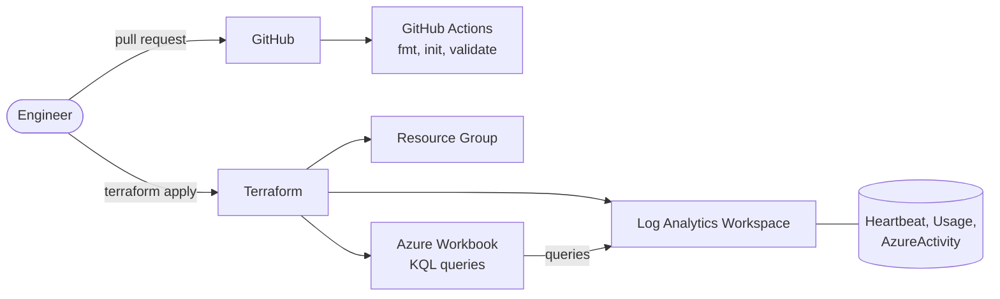

# Azure Workbook Deployment Automation (Terraform)


Infrastructure as Code that deploys a **Log Analytics workspace** and a **KQL-driven Azure Workbook** to multiple environments (`dev`, `prod`) from the same code, with a CI pipeline that checks every change.

> All names and queries in this repo are generic examples. Nothing here comes from any employer.

## Why this project

Manually built dashboards drift between environments and are hard to review. Managing the workbook as code makes it repeatable, reviewable in pull requests, and identical across environments.

## Architecture



## What gets deployed

| Resource | Purpose |
|:--|:--|
| Resource group | Container for the environment |
| Log Analytics workspace | Log storage and KQL query engine |
| Azure Workbook | Dashboard with agent heartbeat, ingestion by table, and failed Azure operations |

## Project structure

```text
azure-workbook-terraform/
├── main.tf                 # resources
├── variables.tf            # inputs with validation
├── outputs.tf              # IDs of deployed resources
├── versions.tf             # Terraform and provider versions
├── workbook.json.tpl       # workbook definition with KQL queries
├── environments/
│   ├── dev.tfvars
│   └── prod.tfvars
└── .github/workflows/terraform-ci.yml
```

## Try it for free (no Azure subscription needed)

The CI pipeline runs `terraform fmt`, `init`, and `validate` in GitHub Actions. It needs no Azure credentials, so a green tick on your Actions tab proves the code is valid.

To run the same checks in a GitHub Codespace (Terraform is preinstalled through `.devcontainer`):

```bash
terraform fmt -recursive
terraform init -backend=false
terraform validate
```

## Deploy to Azure (optional)

Requires an Azure subscription. Check the current free account and pricing terms on the Azure website before you deploy.

```bash
az login
export TF_VAR_subscription_id="<your-subscription-id>"

terraform init
terraform plan  -var-file=environments/dev.tfvars
terraform apply -var-file=environments/dev.tfvars
```

Clean up when finished so nothing keeps running:

```bash
terraform destroy -var-file=environments/dev.tfvars
```

## Design decisions

- **One codebase, many environments:** behaviour changes through `*.tfvars` files, not copied code.
- **Input validation:** invalid environments or retention values fail before anything is deployed.
- **Workbook as a template:** the workbook JSON lives in `workbook.json.tpl`, so changes appear as clean diffs in pull requests.
- **Deterministic workbook ID:** `uuidv5` generates a stable ID per environment, so re-applying never creates duplicates.
- **CI without secrets:** validation runs on every push and pull request with no cloud credentials.

## Roadmap

- [ ] Remote state in Azure Storage with locking
- [ ] Alert rules and action groups managed in the same repo
- [ ] `terraform plan` on pull requests using OIDC federation
- [ ] Reusable module version of the workbook
